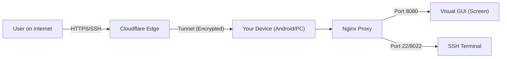

# 🌐 Zero to Server

> **Turn any device into an accessible Cloud Server (Android, Windows, Linux).**

## 📖 About The Project

This project aims to democratize server access. We believe that everyone should be able to own their own server without renting expensive VPSs, simply by utilizing devices they already own (used Android phones, Windows Laptops, or Linux Mini PCs).

The core of this project is transforming a local device into a server that is accessible from anywhere via the internet, securely and easily.

### 🛠️ The Tech Stack (Core)

We use a powerful combination of *open-source* technologies to bypass network restrictions (CGNAT) without needing a static Public IP:

* **☁️ Cloudflare Tunnel:** Expose local servers to the internet securely (no Open Ports on the router).
* **💻 SSH (Secure Shell):** Full access to the server terminal for coding, remote config, and file management (Backend).
* **🖥️ VNC (Virtual Network Computing):** Visual/desktop screen access from the server device via browser (Frontend/GUI).
* **🔧 Nginx:** Reverse proxy to manage traffic between Cloudflare, VNC, and Localhost.

## ⚠️ Disclaimer (Important!)

> **This project is created for EDUCATIONAL and LEARNING purposes.**

This project is developed by a student as a means of researching network infrastructure. Please note the following:

1. **Security:** The security configuration here follows *standard practices* for hobby/dev, not *enterprise-grade*. Do not use this to store banking data, crucial *production databases*, or state secrets. **Use at your own risk.**
2. **Stability:** Server performance depends heavily on device specifications and your home internet connection.
3. **Advanced Research:** Users are highly advised to research further regarding *firewalls*, *SSH Key hardening*, and *token* management to make the server more secure.

## 🗺️ Supported Platforms & Status

Choose the operating system of the device you want to turn into a server:

### 1. 🤖 Android Server (Termux)

> **Status:** ✅ **FIRST RELEASE (Stable)**

Turns an Android phone into a powerful mini Linux Server. Very power-efficient (can even use phones with broken screens).

* **Base:** Termux & Proot-Distro.
* **Features:** Screen access via Browser (noVNC), Full SSH Terminal via VS Code, Auto-Install Script.
* **Suitable for:** Hosting WA/Discord bots, Light Web Server, Learning Linux.

👉 **[Open Android Setup Guide](https://github.com/brotherzhafif/zero-to-server/tree/main/android)**

### 2. 🪟 Windows Server

> **Status:** 🧪 **Beta (Active Development)**

Utilizes a Windows laptop/PC as a server without dual-booting.

* **Base:** PowerShell / WSL (Windows Subsystem for Linux).
* **Features:** Remote Desktop via Browser, PowerShell SSH access.
* **Suitable for:** Game Servers (Minecraft/SAMP), Media Servers (Plex), Heavy processing.

👉 **[Open Windows Setup Guide](https://github.com/brotherzhafif/zero-to-server/tree/main/windows)**

### 3. 🐧 Linux Server (Ubuntu/Debian)

> **Status:** 🧪 **Beta (Active Development)**

Classic setup for devices like Raspberry Pi, Used STBs, or Mini PCs.

* **Base:** Systemd Services.
* **Features:** Full Automation, Docker Support, Hardened Security.
* **Suitable for:** Home Lab, Docker Containers, Home Assistant.

👉 **[Open Linux Setup Guide](https://github.com/brotherzhafif/zero-to-server/tree/main/linux)**

## 🔐 Architecture Overview

In general, here is how your server works across all platforms:

1. **User** accesses the domain (e.g., `server.yourname.com`).
2. **Cloudflare** receives the request and forwards it through a specific path (Tunnel) to your device at home.
3. **Your device** receives the packet without needing Router/Modem settings.
4. **Nginx** inside the device sorts it: "Want to see the screen? Go to VNC. Want to code? Go to SSH."

## 🤝 Contributing

Since this is a community and learning-based project, contributions are highly appreciated! If you have ideas to tighten security or automation scripts for Windows/Linux:

1. Fork this repository.
2. Create a new feature branch (`git checkout -b cool-feature`).
3. Commit your changes (`git commit -m 'Added SSH security features'`).
4. Push to the branch (`git push origin cool-feature`).
5. Create a Pull Request.

## 📞 Author & Contact

Made with ❤️ and ☕ by **Raja Zhafif Raditya Harahap**

* This project is part of the documentation of my learning journey in *System Administration* & *Cloud Engineering*.
* Don't hesitate to open **Issues** if you find bugs or difficulties during setup.

Happy Server Building! 🚀

> Anything is possible with enough determination.